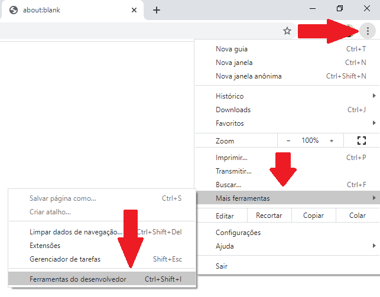
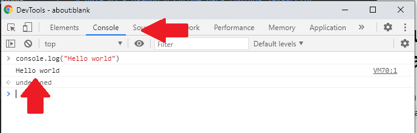

# Aula 03 - Usando o Chrome para códigos Javascript

Com o Chrome aberto, aperte a tecla `F12` ou selecione a opção `Mais ferramentas` **>** `Ferramentas do Desenvolvedor`.

Uma janela chamada `DevTools` será aberta. Nesta, certifique-se de que você está na aba `Console` e perceba que o cursor estará piscando ao lado de um sinal `>`.

Aqui você já pode programar! 🤘 Digite seu código, dê um `Enter` e _voilá_:

---
👈 [Voltar para aula](aula.md)