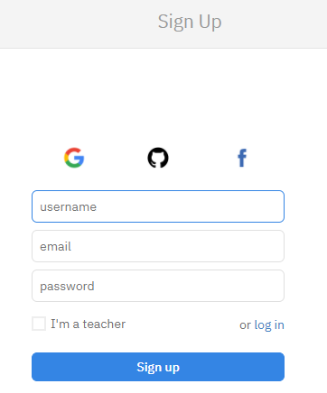
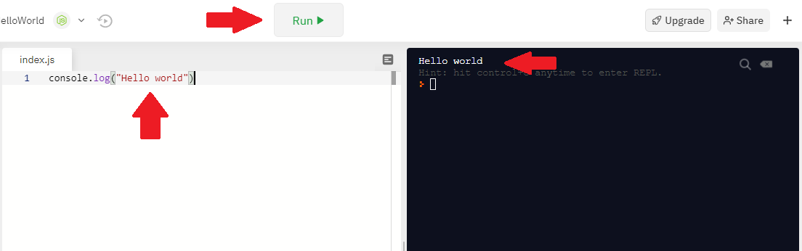

# Aula 03 - Usando o [Repl](http://www.repl.it)

É bem simples utilizar o Repl. Segue os passos abaixo 👇 que não tem erro. 😎 

### 1. Cadastro

Primeiramente você precisará fazer um [cadastro](https://repl.it/signup) na plataforma, o que é bem simples.

Você pode optar por preencher os dados manualmente ou, então, se cadastrar diretamente pelo Facebook ou Google.

### 2. Repositório

Quando você estiver na página principal, após ter realizado o cadastro e o login, localize o botão `+` dentro do bloco "Create".

Depois, basta procurar por `Node.js` e dar um nome para o seu repositório.

### 3. Execução

Quando seu repositório e ambiente de trabalho estiver concluído, basta você escrever o código, clicar em `Run` e _voilá_:

---
👈 [Voltar para aula](aula.md)
