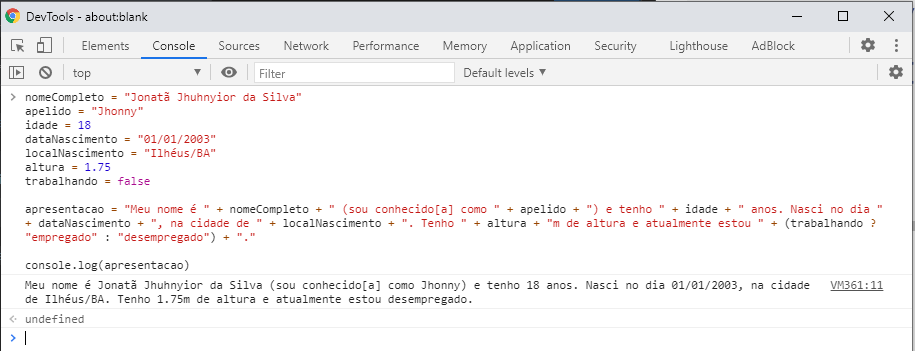

# Aula 04 - Resolução do exercício

O código a seguir foi executado diretamente no navegador Chrome, mas você pode fazê-lo em qualquer outra ferramenta conforme já mencionado nas aulas. 😊

```javascript
nomeCompleto = "Jonatã Jhuhnyior da Silva"
apelido = "Jhonny"
idade = 18
dataNascimento = "01/01/2003"
localNascimento = "Ilhéus/BA"
altura = 1.75
trabalhando = false

apresentacao = "Meu nome é " + nomeCompleto + " (sou conhecido[a] como " + apelido + ") e tenho " + idade + " anos. Nasci no dia " + dataNascimento + ", na cidade de " + localNascimento + ". Tenho " + altura + "m de altura e atualmente estou " + (trabalhando ? "empregado" : "desempregado") + "."

console.log(apresentacao)
```

_Resultado:_



---
👈 [Voltar para aula](aula.md)