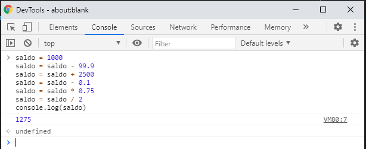

# Aula 05 - Resolução dos exercícios

O nome das variáveis não é o mais relevante para a resolução destes exercícios. O principal aqui é o entendimento da lógica que deve ser aplicada para criação de cada variável. 😉

Fique à vontade para colocar valores fixos _(como a idade de maioridade ou a taxa de juros)_ em diferentes variáveis para melhorar a leitura e compreensão do código. 👊

1)
```javascript
    mesmoNome = (nomeFulano == nomeBeltrano)
```

2) 
```javascript
    maiorDeIdade = (idade >= 18)
```

3) 
```javascript
    valorComJuros = (valorBoleto * 1.1)
```

4) 
```javascript
    mediaAritmetica = (item1 + item2 + item3 + item4 + item5) / 5
```

5) 
```javascript
    lucroBruto = receitaLiquidaVendas - custoProdutosVendidos
    margemBruta = (lucroBruto / receitaLiquidaVendas) * 100
```

6)


---
👈 [Voltar para aula](aula.md)